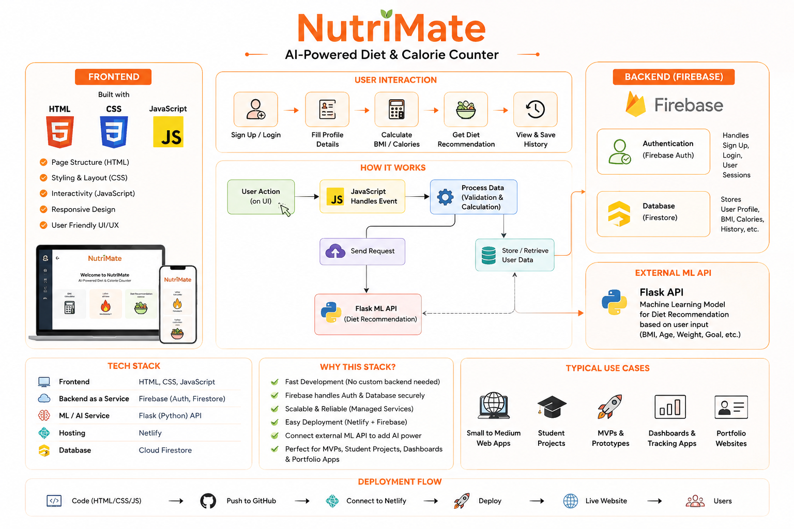

# 🥗 NutriMate

NutriMate is a lightweight web application for **BMI calculation, calorie recommendation, user profiles, and personalized diet suggestions**.  
It combines a simple frontend with **Firebase services and a Flask-based Machine Learning API** to provide an end-to-end nutrition application.

## 🛠️ Tech Stack

| Technology | Use |
|---|---|
| **HTML5** | Creates the structure of web pages, forms, buttons, cards, tables, and input fields |
| **CSS3** | Handles styling, layout, responsive design, animations, colors, and overall UI |
| **JavaScript** | Handles user interactions, BMI/calorie calculations, Firebase operations, API calls, and dynamic page updates |
| **Firebase Authentication** | Provides user Sign Up and Login using email/password authentication |
| **Cloud Firestore** | Stores user profile information and application data in the cloud |
| **Python** | Used to build and train the Machine Learning model |
| **Scikit-Learn** | Provides the `LinearRegression` model for calorie prediction |
| **Flask** | Creates the REST API that connects the frontend with the ML model |
| **Pandas** | Used for handling and preparing the ML dataset |
| **Netlify** | Used for hosting and deploying the frontend |

## 🤖 Machine Learning Model

NutriMate uses **Linear Regression** because the main ML output is the user's **recommended daily calories**, which is a continuous numerical value, making regression suitable for this problem. The model is trained using a small hardcoded dataset of **8 records** containing features such as age, height, weight, goal, and diet type. Goal is encoded as `0 = lose`, `1 = maintain`, `2 = gain`, while diet is encoded as `0 = veg`, `1 = non-veg`, `2 = vegan`. The Flask `/predict` API receives user data as JSON, passes the features to the trained model, and returns the predicted calorie value. The meal recommendation system is currently **rule-based**, not ML-based, and selects predefined meals according to the user's diet type. Currently, `train_model.py` saves `diet_model.pkl`, but `app.py` retrains the model when the server starts instead of loading the saved model.

## 🔮 Future Improvements

- Use a **larger and reliable real-world dataset** instead of only 8 sample records.
- Add more relevant features such as **gender, activity level, fitness level, and health goals**.
- Compare Linear Regression with models such as **Random Forest, Decision Tree, SVM, and other regression algorithms**.
- Evaluate the model using metrics such as **MAE, MSE, and R² score** and use cross-validation.
- Load the saved `diet_model.pkl` in `app.py` instead of retraining the model every time the server starts.
- Replace the rule-based meal system with a **personalized ML-based recommendation system**.
- Add food tracking, nutrition information, progress charts, and personalized diet plans.
- Improve API security, input validation, error handling, and production deployment.